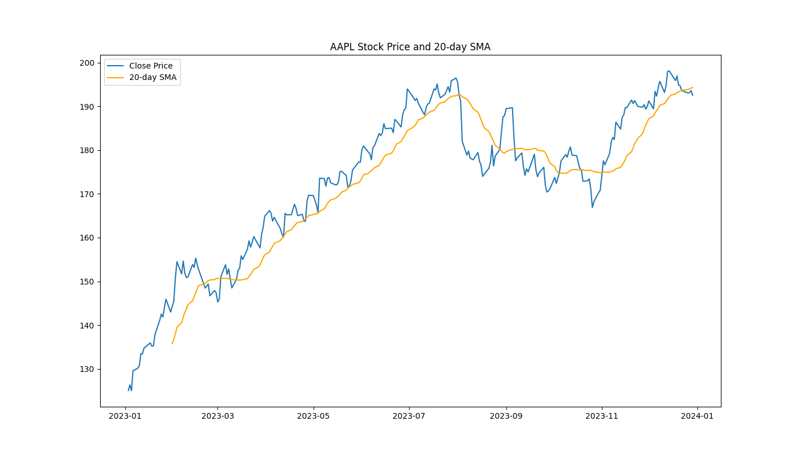
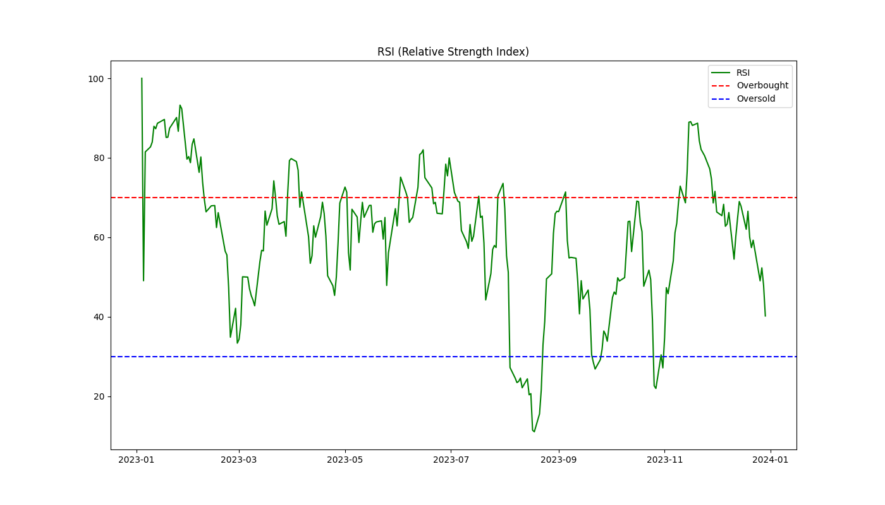
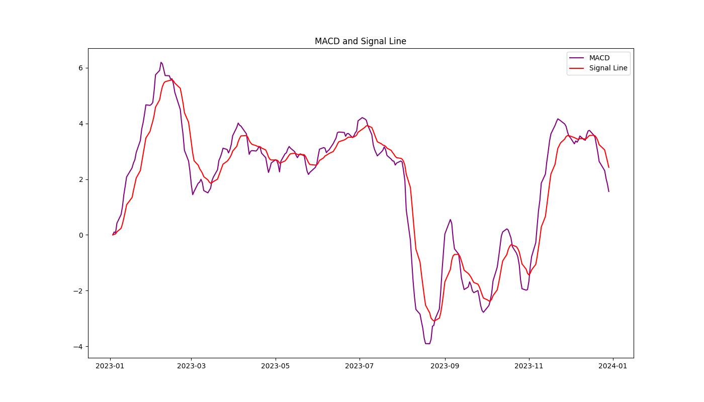

# AAPL Stock Weekly Report

- This project generates an automated weekly financial report for Apple Inc. (AAPL) using Python. The report includes key technical analysis such as the 20-day Simple Moving Average (SMA), Relative Strength Index (RSI), and Moving Average Convergence Divergence (MACD). The final output is a PDF report, which can be easily customized for different stocks and time periods.

# Features
- Data Acquisition: Automatically downloads AAPL stock price data using the yfinance library.
- Technical Analysis: Computes technical indicators including:
- 20-Day Simple Moving Average (SMA): A moving average to smooth short-term price fluctuations.
-  Relative Strength Index (RSI): Indicates whether the stock is overbought or oversold.
-  Moving Average Convergence Divergence (MACD): Helps identify trends and potential buy/sell signals.
-  Visualization: Generates visualizations of these indicators using matplotlib.
-  Automated PDF Report: Generates a professional PDF report using reportlab that includes charts and technical analysis.

# Result
- AAPL_weekly_report.pdf
  
  
  
  
